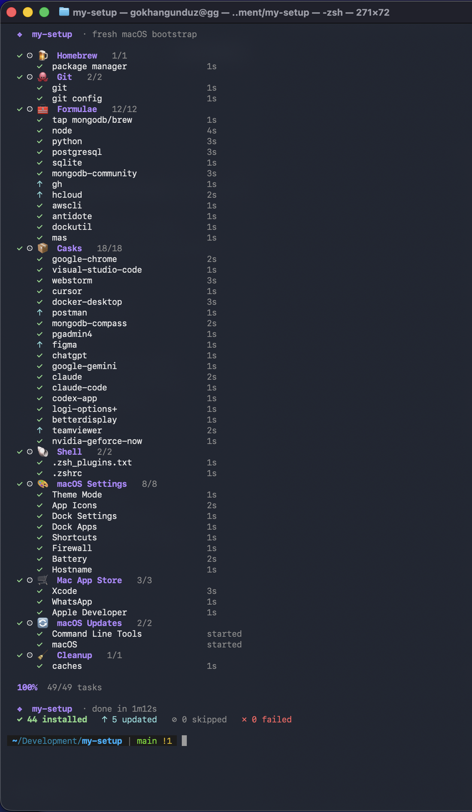

# my-setup

Turn a brand-new Mac into my full dev machine with **one command** — Homebrew,
~50 packages and apps, my zsh setup, macOS settings, and the Dock, all installed
behind a live, app-like progress view. One password prompt, then it runs itself.
Idempotent: re-run any time and it just updates what's stale.

<p align="center">
  
</p>

## Quick start

```bash
/bin/bash -c "$(curl -fsSL https://raw.githubusercontent.com/gokhangunduz/my-setup/main/install.sh)"
```

It clears the screen and runs as a full-screen view — every step expanded, each
item live with what it's doing (`installing`, `upgrading`, …) and its result:

`✓` installed · `↑` updated · `⊘` skipped · `✗` failed

## What it installs

| Category | Items |
| --- | --- |
| **Homebrew** | Installed/updated, PATH wired into `~/.zprofile` |
| **Git** | git + global config (name/email, default branch, `pull.rebase false`) |
| **Formulae** | node, python, postgresql, sqlite, MongoDB Community (`mongodb/brew` tap), gh, hcloud, awscli, antidote, dockutil, mas |
| **Casks** | Chrome, VS Code, WebStorm, Cursor, Docker Desktop, Postman, MongoDB Compass, pgAdmin 4, Figma, ChatGPT, Gemini, Claude, Claude Code, Codex, Logi Options+, BetterDisplay, TeamViewer, GeForce NOW |
| **Shell** | [antidote](https://antidote.sh) loading Powerlevel10k, zsh-autosuggestions/-syntax-highlighting/-completions, and Oh My Zsh plugins (git, brew, docker, gh, aws, npm, …) from `~/.zsh_plugins.txt` |
| **macOS Settings** | Dark mode, app icons, Dock size, Dock apps (pinned in order via `dockutil`), `Cmd+"` shortcut, firewall, battery, hostname |
| **Mac App Store** | Xcode, WhatsApp, Apple Developer (via `mas` — sign into the App Store first) |
| **macOS Updates** | Command Line Tools + macOS checked separately; available updates download in the background |
| **Cleanup** | Runs last — prunes old Homebrew versions and the whole download cache |

## How it behaves

- **Idempotent.** Re-run anytime — already-current items show `⊘ skipped`, outdated
  ones get upgraded (`↑`). It doubles as your update command.
- **Never aborts.** Each step is independent; a failure is logged and reported at
  the end, the rest keeps going. Per-task timeout so nothing hangs forever.
- **Unattended.** sudo is asked once, then a temporary `/etc/sudoers.d/my-setup`
  rule (revoked on exit) keeps anything from prompting again.
- **Safe edits.** `~/.zshrc` gets only a fenced `# my-setup antidote …` block;
  your own lines are untouched. Apple Silicon & Intel both detected.

A few things have no scriptable API and are left for the GUI: wallpaper, iCloud
Photos, screen resolution.

## Customize

No flags, no env vars. Edit the `TAPS` / `FORMULAE` / `CASKS` / `MAS_APPS` /
`ZSH_PLUGINS` arrays, the git identity, or the `_*_prefs` functions at the top of
[`install.sh`](install.sh) — that file is the single source of truth.

## Run it manually

```bash
git clone https://github.com/gokhangunduz/my-setup.git
cd my-setup && less install.sh && ./install.sh
```

## After it finishes

Open a new terminal — the **first** start is slow (antidote clones every plugin
once; later starts are fast). Then run `p10k configure` and launch Docker Desktop
once. Update plugins later with `antidote update`.

## License

[MIT](LICENSE)
